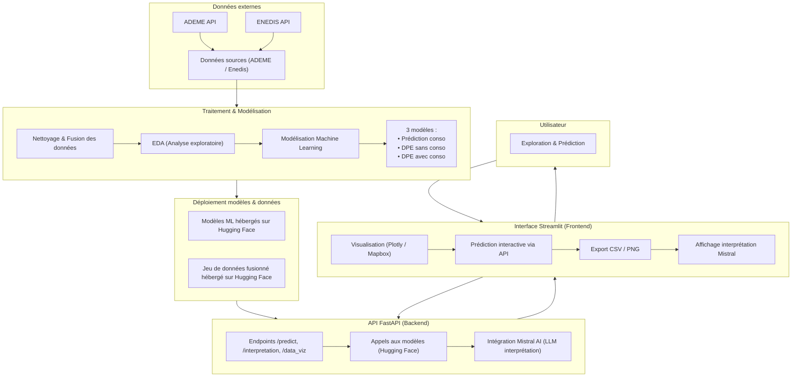

# DPE Rhône 69 — Analyse & Prédiction Énergétique

<p align="center">
  
  
  
  
  
  
</p>

---

## Présentation du projet

L’application **DPE Rhône 69** combine données publiques et intelligence artificielle pour démocratiser l'accès à l'information énergétique dans le département du Rhône à partir des données ouvertes **ADEME** et **Enedis**.

###  Déploiement en ligne
| Service | Lien direct |
|----------|-------------|
|  **API FastAPI** | [https://riadshrn-api-dpe-conso.hf.space/docs](https://riadshrn-api-dpe-conso.hf.space/docs) |
|  **Application Streamlit** | [https://riadshrn-streamlit-dpe-app.hf.space/](https://riadshrn-streamlit-dpe-app.hf.space/) |

---

##  Objectifs principaux

-  **Analyser** les consommations et émissions énergétiques par commune  
-  **Prédire** automatiquement l’étiquette DPE à partir des caractéristiques d’un logement  
-  **Estimer** la consommation énergétique (kWh/m²/an et MWh/an)  
-  **Interpréter** les résultats à l’aide d’un modèle de langage (Mistral AI)  
-  **Visualiser** les données sur une carte interactive  
-  **Comparer** les moyennes locales par commune  

---

##  Architecture du projet

```
m2_enedis_dpe_app/
│
├── app/                      → API FastAPI (backend)
├── streamlit_app/            → Interface Streamlit (frontend)│
├── data/                     → Données locales (ADEME, Enedis)
├── models/                   → Dossiers de modèles complets
├── notebooks/                → Analyses exploratoires & modélisation
├── docker-compose.yml        → Orchestration multi-conteneurs
└── academic_report/          → Rapport d’étude 
```

---

## Schéma général de l’écosystème applicatif



---

##  Fonctionnalités principales

| Catégorie | Fonctionnalité |
|------------|----------------|
|  **Visualisation** | Carte interactive des logements du Rhône avec couleurs par étiquette DPE |
|  **Dashboard DPE** | Analyse de la distribution énergétique et des émissions GES |
|  **Prédiction IA** | Estimation de la classe énergétique et de la consommation annuelle |
|  **Interprétation automatique** | Conseils générés par Mistral AI |
|  **Exports** | Téléchargement des données filtrées (CSV) et graphiques (PNG) |
|  **API REST** | Endpoints pour prédiction, données et métadonnées |
|  **Docker** | Conteneurisation et déploiement multi-service |

---

##  Technologies utilisées

| Domaine | Outil | Description |
|----------|--------|-------------|
| **Backend** |  | Framework web Python asynchrone |
| **Frontend** |  | Interface interactive et dynamique |
| **Machine Learning** |  | Entraînement et prédiction des modèles |
| **Visualisation** |  | Graphiques et cartes Mapbox |
| **Conteneurisation** |  | Déploiement et portabilité |
| **IA Générative** |  | Génération automatique de conseils |
| **Déploiement Cloud** |  | Hébergement API + App |
| **Data** |  | Traitement et préparation des données |
| **Stockage** |  | Données compressées efficaces |

---

##  Déploiement local avec Docker

### Prérequis
- **Docker Desktop** installé  
- (Optionnel) **Python 3.10+** si exécution manuelle

### Étapes
```bash
# Construction et démarrage
docker compose up --build

# Arrêt des services
docker compose down
```

### Accès local
| Service | URL | Description |
|----------|-----|-------------|
|  Streamlit | http://localhost:8501 | Interface principale |
|  FastAPI | http://localhost:8000 | Backend et API |
|  Swagger | http://localhost:8000/docs | Documentation interactive |

---

##  Exécution sans Docker

**Backend :**
```bash
cd app
pip install -r requirements.txt
uvicorn main:app --reload
```

**Frontend :**
```bash
cd streamlit_app
pip install -r requirements.txt
streamlit run app.py
```

---

##  Exemples d’endpoints API

| Méthode | Endpoint | 
|----------|-----------|
| `GET /` | Accueil |
| `POST /predict_dpe_sans_conso` | Prédiction étiquette DPE sans conso |
| `POST /predict_dpe_avec_conso` | Prédiction DPE avec conso |
| `POST /predict_conso` | Estimation consommation |
| `POST /interpretation` | Analyse Mistral AI |
| `GET /metadata` | Données de l'adem et enedis |
| `GET /data_viz` | Données agrégées pour visualisation |


---

## Ressources associées
- [Documentation technique](./academic_report/DOCUMENTATION_TECHNIQUE.md)
- [Rapport académique (Markdown)](./academic_report/)
- [Notebooks de modélisation](./notebooks/)
- [Docker Compose](./docker-compose.yml)
