# Documentation fonctionnelle de l’application DPE & Énergie – Projet Enedis / ADEME

## Objectif général

Cette application web interactive a pour but d’analyser, visualiser et prédire la **performance énergétique (DPE)** des logements à partir de données réelles issues des bases **ADEME** et **Enedis**.  
Elle intègre une API de prédiction, un front-end interactif et un module d’interprétation automatique via **Mistral AI**.

L’application vise à :
- Sensibiliser les utilisateurs à leur consommation énergétique.
- Fournir une estimation du DPE à partir des caractéristiques physiques du logement.
- Identifier les pistes d’amélioration énergétique grâce à l’IA générative.
- Comparer les performances énergétiques entre communes et typologies de logements.

---

## Structure et pages de l’application

### Page d’accueil
**Rôle :** introduction et navigation.  
Elle présente :
- Le contexte du projet.
- Les liens vers le rapport technique, le rapport fonctionnel et la partie modélisation.
- Une synthèse des fonctionnalités principales de l’application.  

  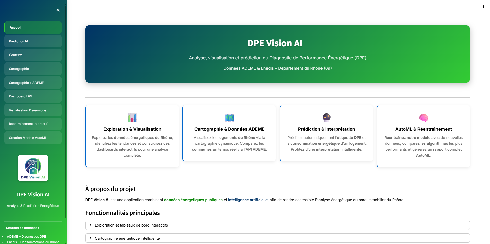

---

### Contexte & Exploration des données
**Objectif :** visualiser et comprendre les jeux de données utilisés.  
Fonctionnalités :
- Exploration filtrée du dataset ADEME/Enedis/DataGouv.
- Téléchargement des jeux de données filtrés au format CSV.

  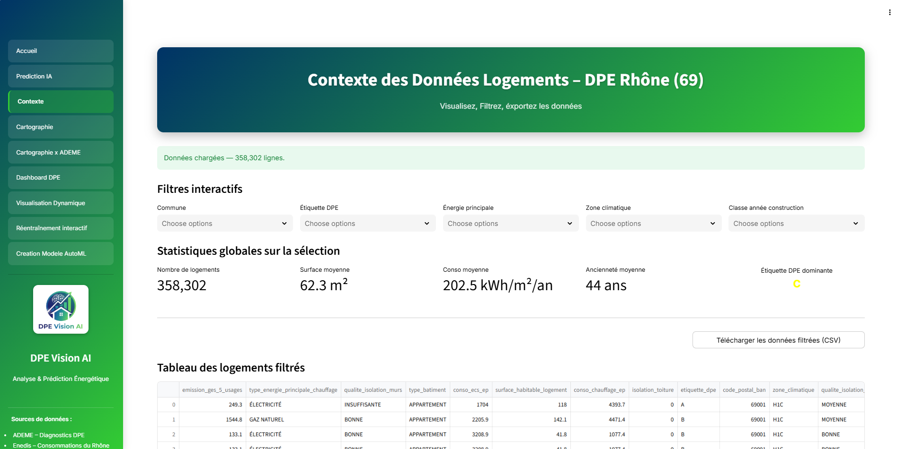

---

### Prédiction IA (DPE & consommation)
**Objectif :** estimer le DPE d’un logement selon ses caractéristiques physiques et sa consommation.  
Fonctionnalités :
- **Triple prédiction :**
  1. Étiquette DPE basée sur les caractéristiques thermiques (sans conso réelle).  
  2. Prédiction de la **consommation énergétique (kWh/m²/an)**.  
  3. Calcul d’une **étiquette finale** combinée avec la consommation réelle ou prédite.
- Interface guidée pour la saisie utilisateur.
- **Interprétation automatique via Mistral AI** :
  - Analyse du DPE estimé.
  - Comparaison à la moyenne de la commune.
  - Conseils personnalisés pour améliorer la performance énergétique.

  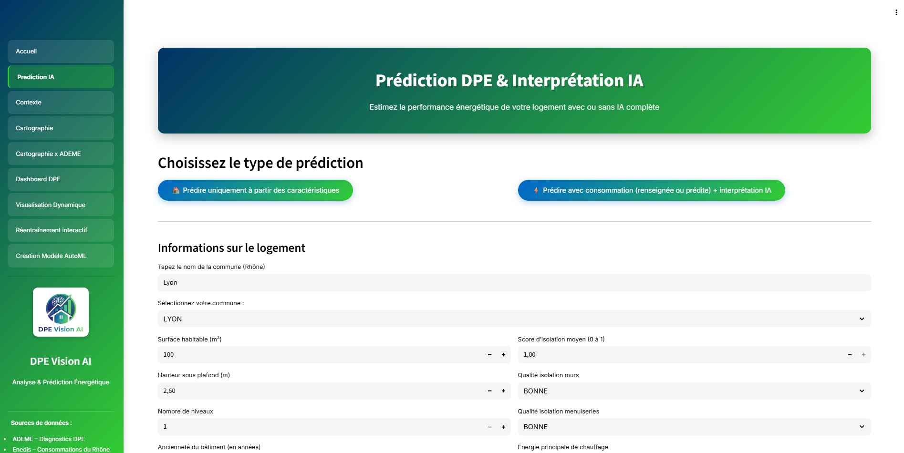

  

| Résultats | Explication IA |
|:--------------------------------:|:------------------------------------------:|
| 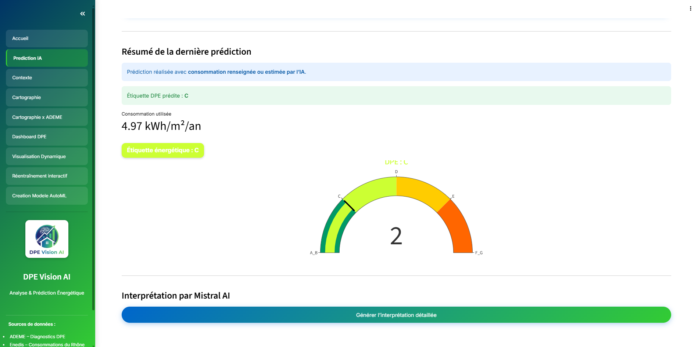 | 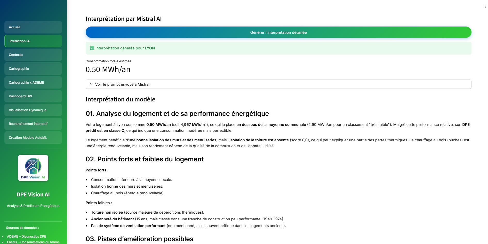 |

---

### Cartographie énergétique
**Objectif :** explorer les logements DPE du Rhône (69) de manière géographique.  
Fonctionnalités :
- Carte interactive colorée selon l’étiquette DPE (A → G).
- Filtres : commune, code postal, type de bâtiment, étiquette DPE, consommation.
- Export CSV/PNG des données et cartes.
- Fiche technique d’un logement sélectionné.

  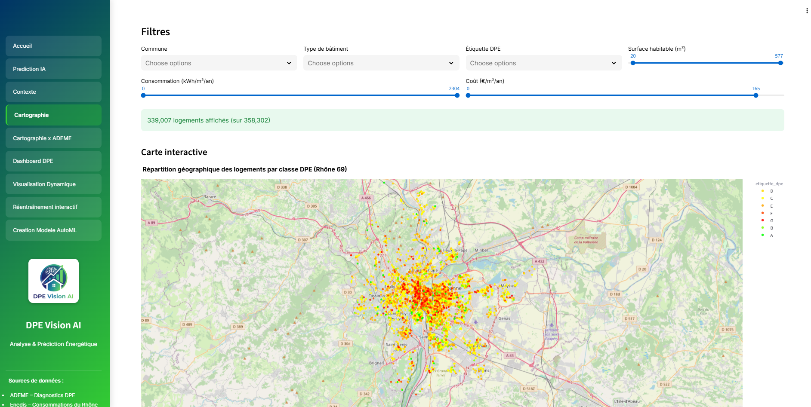

 

---

### DPE Vision AI × ADEME en temps réel
**Objectif :** suivre les nouveaux DPE transmis par l’ADEME.  
Fonctionnalités :
- Récupération **automatique** des DPE récents via l’API officielle ADEME.
- Visualisation multi-communes avec filtres temporels.
- **Comparaison entre deux communes :**
  - Consommation moyenne, coût, étiquettes dominantes.
  - Génération d’un **rapport PDF** complet (Cartes, KPIs ...).

  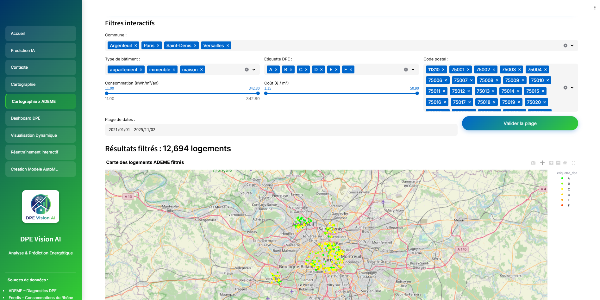

 

  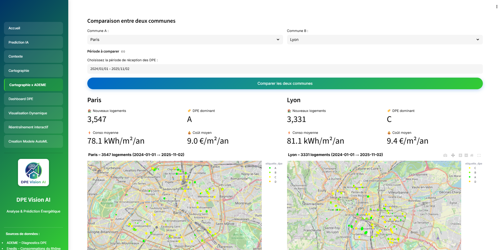

 

  

---

### Dashboard DPE
**Objectif :** visualiser les indicateurs énergétiques du département du Rhône (69).  
Fonctionnalités :
- **KPIs** : consommation moyenne, coût énergétique, émissions GES.
- **13** graphiques interactifs filtrables (type bâtiment, commune, zone climatique…).
- Carte choroplèthe du DPE par commune.
- Sélection dynamique de **4 graphiques** selon les besoins de l’utilisateur.

  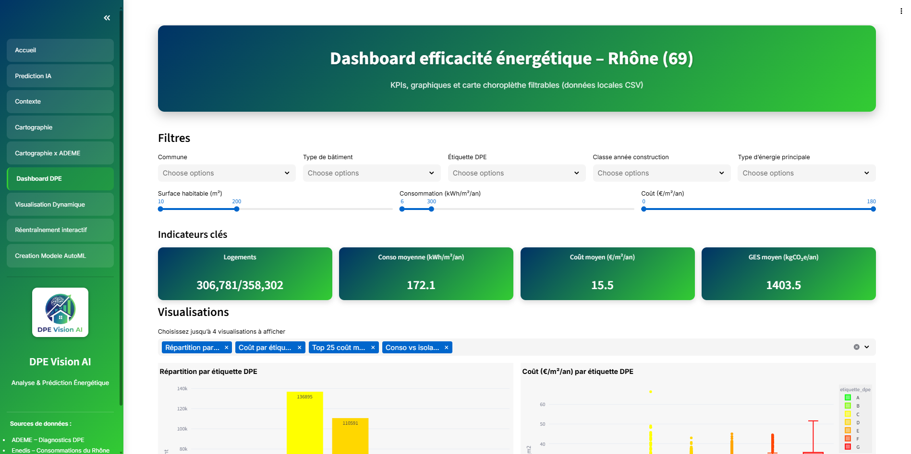

   

  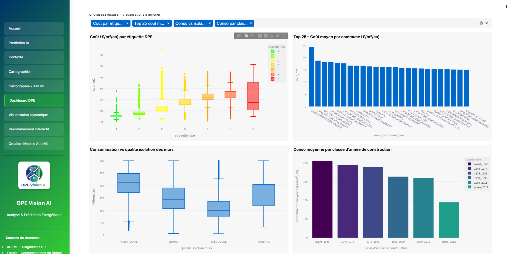

---

### Visualisation dynamique
**Objectif :** créer des graphiques sur mesure selon le type souhaité.  
Graphiques disponibles :
`scatter`, `line`, `bar`, `histogram`, `box`, `violin`, `pie`, `scatter_3d`, `density_heatmap`, `area`.  
Fonctionnalités :
- Sélection interactive des variables X/Y et du type de graphique.
- Export CSV et PNG.
- Génération automatique du graphique selon les données filtrées.

  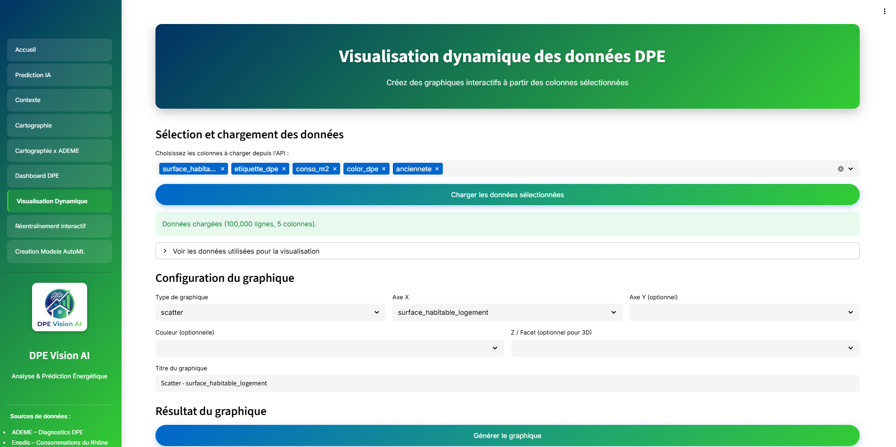

  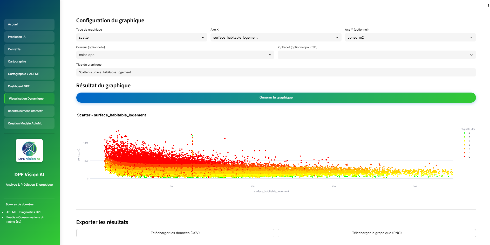

---

### Réentraînement interactif du modèle
**Objectif :** permettre à l’utilisateur de **réentraîner le modèle DPE** selon ses propres données.  
Fonctionnalités :
- Import d’un CSV utilisateur ou génération d’un dataset simulé (10 000 lignes).
- Entraînement complet avec split train/test et suivi des performances.
- Visualisation :
  - Matrice de confusion annotée.
  - Rapport de classification.
  - Graphique des F1-score.
- Export du modèle entraîné (`.joblib`).

  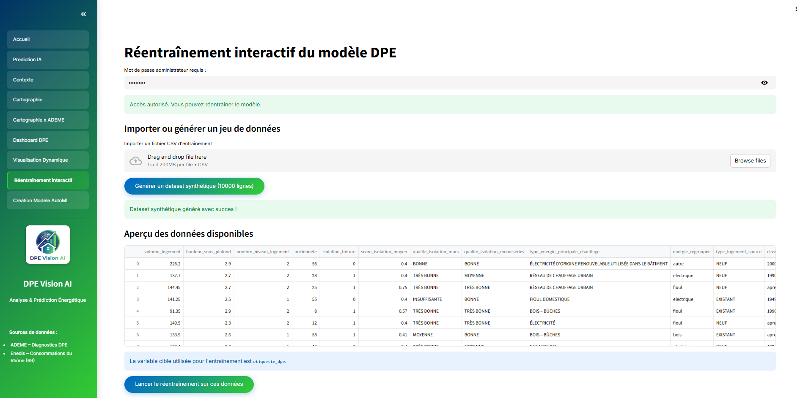

  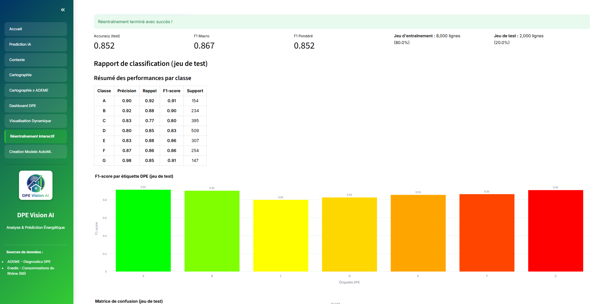

---

### AutoML – Évaluation automatique de modèles
**Objectif :** comparer plusieurs algorithmes pour la prédiction du DPE.  
Algorithmes testés :
- RandomForest, DecisionTree, GradientBoosting, AdaBoost, LogisticRegression, KNN, SVM (RBF).  
Fonctionnalités :
- Entraînement automatique sur 10 000 logements simulés.
- Comparaison selon *Accuracy*, *F1-score*, *Recall*, *Précision*.
- Visualisation et sélection du meilleur modèle.
- **Génération d’un rapport PDF complet AutoML** : hyperparamètres, matrices de confusion, scores comparatifs.

  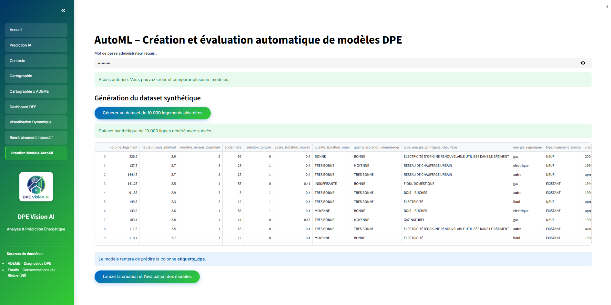

 

| Résultats | Fiche modèles |
|:--------------------------------:|:------------------------------------------:|
| 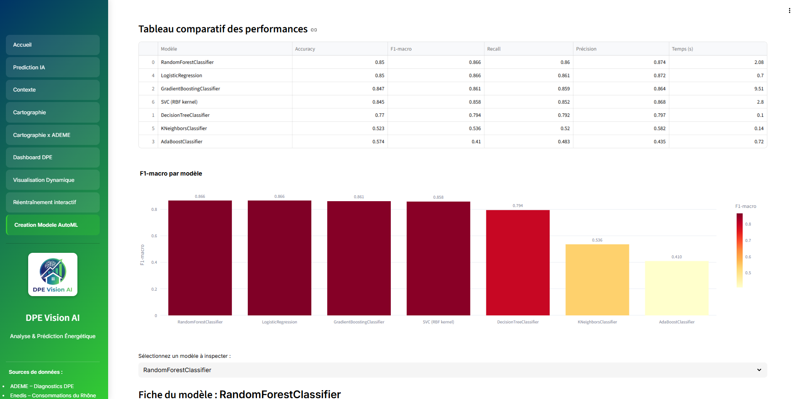 | 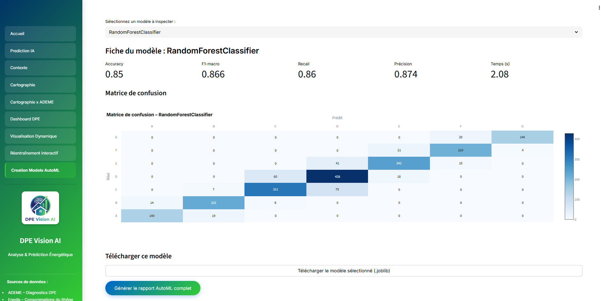 |

  

---

### Architecture & intégration technique
- **Backend :** FastAPI → API REST (prédiction, interprétation, ADEME Live).  
- **Frontend :** Streamlit → interface utilisateur dynamique et réactive.  
- **Modélisation :** scikit-learn, pandas, numpy, plotly.  
- **Déploiement :** Docker + hébergement Hugging Face Spaces.  
- **Sources :** ADEME (DPE) + Enedis (consommations énergétiques du Rhône 69).

  

---

## Conclusion

L’application fournit un écosystème complet pour la **gestion, la visualisation et la prédiction du DPE**, combinant la puissance des données ADEME/Enedis, du **Machine Learning** et de l’**IA générative** pour l’interprétation.  
Elle se positionne comme un outil de **décision énergétique locale** et un **prototype de Smart Dashboard écologique** à échelle territoriale.

