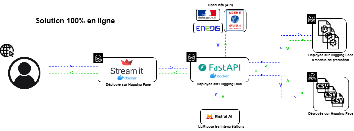
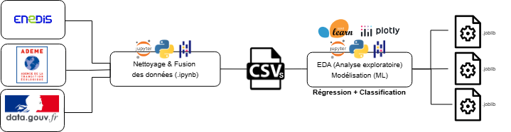

# Documentation Technique — Application DPE Rhône 69

## Objectif

L’application **DPE Rhône 69** permet d’analyser et de prédire la **performance énergétique (étiquette DPE)** et la **consommation annuelle** des logements du département du Rhône à partir des données publiques **ADEME** et **Enedis**.

Elle repose sur trois modules principaux :
1. Une **API FastAPI** pour la prédiction et l’interprétation IA.  
2. Une **interface Streamlit** pour la visualisation et l’interaction utilisateur.  
3. Une **infrastructure Docker** pour le déploiement reproductible et simplifié.

---

## Architecture du système

### Schéma d’architecture global

<p align="center">
  
</p>

Ce schéma illustre l’organisation générale des composants du projet :  
- L’utilisateur interagit avec **l’application Streamlit** hébergée sur Hugging Face.  
- Streamlit envoie des requêtes à l’**API FastAPI** (autre service Hugging Face).  
- L’API interroge les **modèles de Machine Learning** (hébergés et compressés) pour prédire la classe DPE et la consommation.  
- Les résultats peuvent être interprétés par **Mistral AI** pour générer un texte explicatif.  
- Toutes les données ADEME et Enedis sont traitées, nettoyées et fusionnées localement avant publication.

---

## Chaîne de traitement des données

<p align="center">
  
</p>

Ce schéma représente la pipeline complète :
1. **Collecte** des données depuis les **APIs ADEME** et **Enedis** et **Data Gouv**.  
2. **Nettoyage et fusion** dans des notebooks Jupyter (traitement des doublons, homogénéisation des communes, conversion des unités, etc.).  
3. **Analyse exploratoire (EDA)** et visualisation des distributions via Plotly.  
4. **Modélisation Machine Learning** avec scikit-learn :  
   - Prédiction de la **consommation énergétique (régression)**  
   - Prédiction du **DPE sans consommation**  
   - Prédiction du **DPE avec consommation**  
5. Export du dataset final au format **CSV/Parquet**, utilisé dans les modules FastAPI et Streamlit.

---

## Installation sur poste local (via Docker)

### Prérequis
- **Docker Desktop** installé (version ≥ 24.0)
- Connexion internet active
- (Optionnel) **Python ≥ 3.10** si exécution manuelle sans Docker

---

### Clonage du dépôt

```bash
git clone https://github.com/riadshrn/m2_enedis_dpe_app.git
cd m2_enedis_dpe_app
```

---

### Lancement complet avec Docker Compose

```bash
docker compose up --build
```

Premier lancement : environ **1 à 2 minutes** pour la construction des images.

---

### Accès aux services

| Service | URL locale | Description |
|----------|-------------|--------------|
| Streamlit App | http://localhost:8501 | Interface utilisateur |
| FastAPI | http://localhost:8000 | API de prédiction |
| Swagger UI | http://localhost:8000/docs | Documentation API |


---

## Environnement logiciel et bibliothèques

### Backend – API (FastAPI)

| Package | Version  | Description |
|----------|--------------------------|-------------|
| fastapi | 0.115.4 | Framework web Python asynchrone |
| uvicorn | 0.32.0 | Serveur ASGI pour FastAPI |
| pandas | 2.2.3 | Manipulation de données |
| scikit-learn | 1.5.2 | Modélisation et apprentissage automatique |
| joblib | 1.4.2 | Sérialisation des modèles |
| requests | 2.32.3 | Requêtes HTTP (API / Mistral) |
| tqdm | 4.66.5 | Barre de progression |
| pyarrow | 17.0.0 | Format de données Parquet |
| fastparquet | 2024.5.0 | Lecture/écriture de fichiers Parquet |

---

### Frontend – Interface Streamlit

| Package | Version  | Description |
|----------|--------------------------|-------------|
| streamlit | 1.38.0 | Interface web interactive |
| pandas | 2.2.3 | Manipulation de DataFrame |
| plotly | 5.24.1 | Visualisation interactive et cartes Mapbox |
| requests | 2.32.3 | Communication avec l’API FastAPI |
| kaleido | 0.2.1 | Export d’images Plotly (PNG) |
| streamlit_plotly_events | 0.0.6 | Interaction entre graphiques et Streamlit |


---

## Déploiement Hugging Face

| Composant | URL |
|------------|-----|
| API FastAPI | [https://riadshrn-api-dpe-conso.hf.space/docs](https://riadshrn-api-dpe-conso.hf.space/docs) |
| App Streamlit | [https://riadshrn-streamlit-dpe-app.hf.space](https://riadshrn-streamlit-dpe-app.hf.space) |
