# Étude de Modélisation Énergétique des Logements du Rhône (69)

---

## 1. Contexte & Objectifs

### 1.1 Pourquoi cette étude ?
Le Diagnostic de Performance Énergétique (DPE) est devenu un critère décisif pour :
- la valeur d'un bien,
- la mise en location,
- l'obligation de rénovation thermique.

L'accès à ces informations est aujourd'hui limité : il faut un audit thermique officiel, payant, et toutes les données ne sont pas faciles à lire pour un citoyen.

**Objectif général du projet :**  
Donner à n'importe quel ménage du département du Rhône une estimation fiable de sa classe énergétique (A→G) et de sa consommation annuelle, sans avoir besoin d'un audit complet.

### 1.2 Objectif technique
Nous avons construit une chaîne complète :
1. **Collecte / fusion de données réelles**  
   - DPE ADEME (caractéristiques bâtiment + étiquette DPE officielle)
   - Consommations Enedis agrégées par zone IRIS
2. **Préparation / nettoyage / feature engineering**
3. **Entraînement de modèles de Machine Learning**
4. **Exposition temps réel**
   - via une API (FastAPI)
   - via une interface utilisateur Streamlit (cartographie et simulation)
   - génération d'interprétations automatiques via LLM (Mistral)


### 1.3 Cas d’usage métier
Concrètement, l’utilisateur peut :
- décrire son logement (surface, année, isolation, énergie de chauffage…),
- obtenir :
  - une **étiquette DPE prédite**,
  - une **estimation de consommation finale en kWh/m²/an**,
  - une **explication des facteurs principaux qui dégradent sa performance**.

Ce n’est pas juste un modèle académique : c’est un prototype d’outil d’aide à la décision énergétique locale.

---

## 2. Données & Préparation

### 2.1 Sources de données
- **Base ADEME DPE Rhône (69)**  
  ~358 302 logements après nettoyage  
  Variables : caractéristiques thermiques, équipements, année de construction, surface habitable, consommation estimée, étiquette DPE officielle. :contentReference[oaicite:1]{index=1}

- **Enedis – Consommations électriques réelles**  
  Données agrégées par zone IRIS.  
  Ces données permettent de confronter les consommations “déclarées dans le DPE” à des consommations réellement observées sur le territoire.

- **Géolocalisation / contexte climatique**  
  Rattachement des logements à leur zone climatique et à leur zone IRIS → utile pour capturer l’effet du climat local et du contexte urbain.

---

### 2.2 Flux de traitement

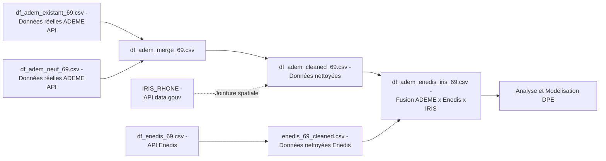

### 2.3   Sources de données utilisées

| Source                                      | Fichier local                     | Type de données                                          | Origine / API                                                                                   | Description synthétique |
|--------------------------------------------|-----------------------------------|----------------------------------------------------------|--------------------------------------------------------------------------------------------------|--------------------------|
| ADEME – DPE logements existants            | `df_adem_existant_69.csv`         | Diagnostics de Performance Énergétique (DPE)             | [data.ademe.fr](https://data.ademe.fr/datasets/dpe03existant)                                                 | Données réelles issues de l’API ADEME (logements existants). |
| ADEME – DPE logements neufs                | `df_adem_neuf_69.csv`             | Diagnostics de Performance Énergétique (DPE)             | [data.ademe.fr](https://data.ademe.fr/datasets/dpe02neuf)                                                 | Données réelles issues de l’API ADEME (logements neufs). |
| Enedis – Consommations électriques IRIS     | `df_enedis_69.csv`                | Consommations réelles agrégées par zone IRIS             | [data.enedis.fr](https://data.enedis.fr/api/)                                              | Données réelles de consommation énergétique (électricité) issues de l’API Enedis. |
| Grand Lyon – Données géospatiales IRIS Rhône| `IRIS_RHONE data.grandlyon`       | Contours géographiques des zones IRIS du Rhône           | [data.gouv.fr](https://www.data.gouv.fr/datasets/contours-iris-r-2)                             | Données géographiques officielles pour la jointure spatiale (rattachement des logements). |
| Jeu final fusionné                          | `df_adem_enedis_iris_69.csv`      | Données nettoyées et enrichies ADEME × Enedis × IRIS     | —                                                                                                | Base finale utilisée pour l’analyse exploratoire et la modélisation énergétique. |

### 2.4 Nettoyage des données

Le notebook `03_data_cleaning.ipynb` applique des règles de qualité pour éliminer les enregistrements absurdes ou incohérents.

- **Filtrage des extrêmes physiques**
  - Suppression des logements avec consommation énergétique totale anormalement élevée.
    - L’EDA montre une distribution de la consommation très asymétrique (“long tail”) : la plupart des logements sont entre ~5 000 et 20 000 kWhEP/an, mais quelques cas montent très haut.
    - Les valeurs extrêmes (ex. > 50 000 kWhEP/an) sont rares et considérées soit comme erreurs de saisie, soit comme logements très atypiques.
  - Suppression des consommations par m² considérées comme physiquement impossibles (> 2000 kWh/m²/an).

- **Surface habitable**
  - Exclusion des logements avec surface habitable `< 9 m²` (studio techniquement illégal / erreur) ou `> 500 m²` (résidences hors profil standard individuel).
  - Objectif : rester sur du résidentiel “classique”.

- **Année de construction**
  - Suppression des années hors plage crédible (`< 1800` et `> 2025`).
  - L’année de construction sert ensuite à calculer l’âge du bâtiment, donc elle doit être fiable.

- **Valeurs manquantes**
  - Les variables critiques pour l’énergie (chauffage, isolation toiture/murs/menuiseries) sont conservées uniquement quand elles sont renseignées.
  - Pour des variables secondaires ou catégorielles, une imputation ultérieure est prévue dans la pipeline scikit-learn (voir section Modélisation), mais les lignes sans informations structurantes ont été retirées.

Résultat attendu après ces filtres : un dataset propre, cohérent physiquement, représentatif.


### 2.5 Analyse exploratoire (EDA) des variables énergétiques

Le notebook `04_eda_visualization.ipynb` fait l’EDA sur les données ADEME nettoyées, avant enrichissement Enedis.

Objectifs de l’EDA :
- vérifier les distributions,
- repérer les outliers,
- comprendre les facteurs énergétiques dominants,
- préparer les choix de features pour la suite.

Points majeurs issus de l’EDA :

1. **Distribution de la consommation énergétique totale (kWhEP/an)** 
        <p align="center">
          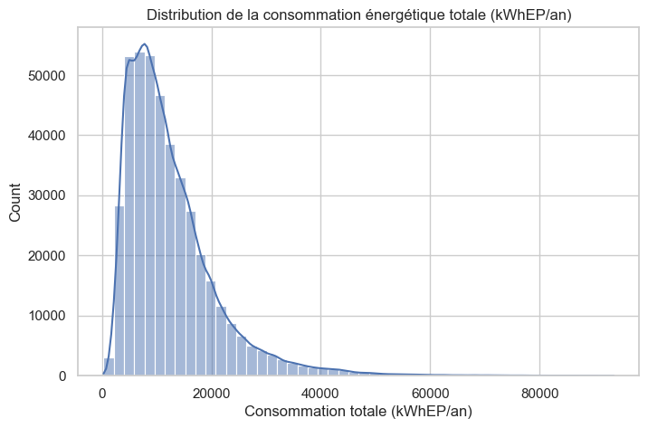
        </p>        
   - La distribution est fortement asymétrique à droite.
   - Interprétation : la plupart des logements ont une conso “normale”, mais une minorité consomme énormément.
   - Conclusion méthodologique : on va utiliser une **transformation logarithmique** plus tard pour la régression de la consommation, afin de stabiliser la variance.
<br>

2. **Étiquettes DPE (A→G) dans le département 69**  
        <p align="center">
          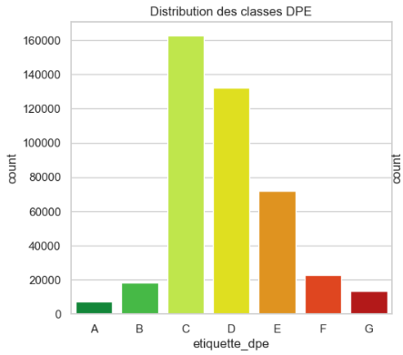
        </p>  
   - Forte concentration dans les classes C, D, E.
   - Peu de logements classés A ou B.
   - Interprétation : le parc du Rhône est majoritairement “moyen / ancien”, pas basse conso.
   - Impact : déséquilibre du coup il faudra regrouper certaines classes et gérer le déséquilibre lors de l’apprentissage.
<br>

3. **Corrélations internes**  
        <p align="center">
          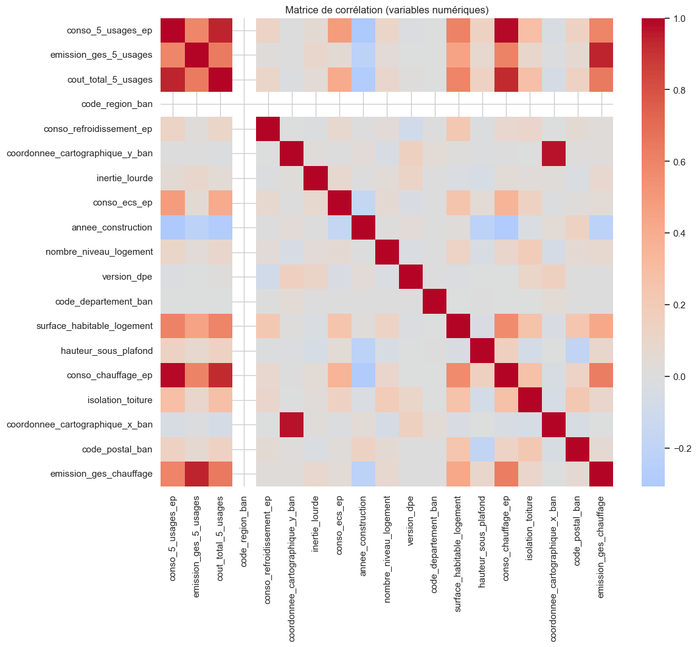
        </p>
   - Plusieurs variables se recouvrent presque totalement :
     - `emission_ges_5_usages`
     - `cout_total_5_usages`
     - `conso_totale_mwh` ...etc
   - Ces colonnes sont très fortement corrélées à la consommation totale déclarée (`conso_5_usages_ep`), parfois avec |r| > 0.9.
   - Décision : supprimer ces colonnes redondantes pour éviter la multicolinéarité et réduire le bruit.


### 2.6 Feature engineering (incluant enrichissement territorial)

Le cœur du travail de préparation se fait ici. C’est ce qui transforme les données brutes en variables explicatives pertinentes pour le modèle.  
Il est réalisé dans `04_eda_visualization.ipynb`, `05_enedis_merge.ipynb`, `06_eda_merged_iris.ipynb` et finalisé dans `07_modélisation_preparation.ipynb`.

Principales features construites :

1. **Âge du bâtiment**
   - Calcul d’une variable `anciennete = 2025 - annee_construction`
   - Intérêt : l’âge thermique du bâti résume implicitement les normes de construction.
   - On dérive aussi une classe catégorielle `classe_annee_construction`, par tranches.
   - Ces classes sont utilisées comme variables catégorielles lisibles métier.

2. **Score d’isolation global**
   - Les notebooks combinent plusieurs champs de diagnostics : `isolation toiture`, `qualité d’isolation des murs`, `qualité d’isolation des menuiseries`.
   - On agrège ces indicateurs en un score synthétique (ex. moyenne ou encodage ordinal combiné).
   - Idée : donner une mesure unique de la qualité d’enveloppe thermique du logement.

    ```py
    def score_isolation(row):
        mapping = {"faible": 1, "moyenne": 2, "bonne": 3}
        cols = ["qualite_isolation_murs", "qualite_isolation_menuiseries", "isolation_toiture"]
        vals = [mapping.get(str(row[c]).lower(), np.nan) for c in cols]
        vals = [v for v in vals if not np.isnan(v)]
        return np.mean(vals) if len(vals) > 0 else np.nan
    ```

3. **Énergie de chauffage regroupée**
   - Les types d’énergie du chauffage principal (souvent très verbeux dans les données ADEME) sont regroupés en 4 grandes familles : `Électricité`, `Gaz`, `Fioul`...
   - Intérêt : ça évite d’avoir 15 modalités rares impossibles à généraliser, et ça facilite l’interprétation métier.

4. **Volume et géométrie du logement**
   - Variables comme `surface_habitable_logement`, `volume_logement`, `hauteur_sous_plafond`, `nombre_niveau_logement`.
   ```py
   df["volume_logement"] = df["surface_habitable_logement"] * df["hauteur_sous_plafond"]
   ```
   - Rôle : capturer le volume à chauffer et l’inertie thermique.
   - Observation en EDA : ces variables expliquent une grosse partie de la consommation, donc elles sont conservées comme features majeures.

5. **Zone climatique / localisation**
   - Grâce au rattachement géospatial aux IRIS du Rhône (`05_enedis_merge.ipynb`), chaque logement hérite :
     - d’une `zone_climatique` (par ex. H1c, etc.),
     - de la consommation moyenne observée dans cette zone IRIS (venant d’Enedis).
   - Intérêt : deux logements identiques ne consomment pas pareil selon le climat local et le tissu urbain (pertes, déperditions, habitudes de chauffe).
   - Cette étape est réalisée en fusionnant :
     - `df_adem_cleaned_69.csv` (logements individuels),
     - `enedis_69_cleaned.csv` (consommations par IRIS),
     - la couche géo `IRIS_RHONE` (frontières IRIS).
   - Le résultat final enrichi est `df_adem_enedis_iris_69.csv`.

        <p align="center">
          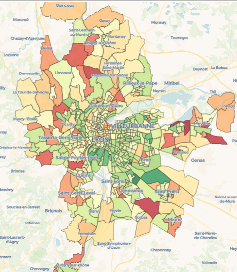
        </p>

6. **Regroupement des classes DPE pour l’apprentissage**
   - Les classes DPE officielles A, B, C, D, E, F, G sont très déséquilibrées.
   - On construit une cible regroupée en 5 classes : `A_B`,`C`, `D`, `E`, `F_G` 
   - Objectif :
     - stabiliser l’apprentissage,
     - garantir assez d’observations par classe,
     - mieux détecter les passoires (`F_G`) et les logements très performants (`A_B`).

        <p align="center">
          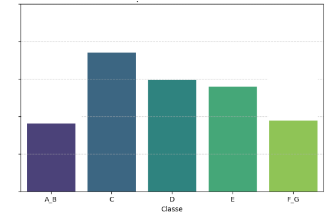
        </p>  


## 3 Jeu d’entraînement final

À l’issue de ces étapes :
- On obtient un dataset prêt pour le Machine Learning contenant :
  - des variables numériques normalisables (surface, volume, conso ECS, ancienneté…),
  - des variables catégorielles encodables (type énergie, zone climatique, classe d’année de construction…),
  - des features dérivées métier (score d’isolation, âge du bâti),
  - du contexte territorial (consommation moyenne IRIS, zone climatique),
  - la cible `etiquette_dpe_grp` (A_B / C / D / E / F_G).
 
### 3.1 Équilibrage des classes pour l'apprentissage
Le DPE est très déséquilibré : très peu de A/B, beaucoup de C/D/E.  
On a :
- regroupé les classes en 5 catégories : `A_B`, `C`, `D`, `E`, `F_G`.
- appliqué **SMOTE** pour rééquilibrer lors de l'entraînement.

### 3.2 Conclusion de l’exploration (EDA final)

##### Variables conservées pour la modélisation
- **Numériques** :  
  `surface_habitable_logement`, `annee_construction`, `conso_chauffage_ep`,  
  `conso_ecs_ep`, `emission_ges_5_usages`, `hauteur_sous_plafond`,  
  `conso_moy_site_mwh` (Enedis), `nombre_de_logements`.

- **Catégorielles** :  
  `type_batiment`, `type_energie_principale_chauffage`,  
  `qualite_isolation_murs`, `qualite_isolation_menuiseries`,  
  `isolation_toiture`, `type_installation_chauffage`.

##### Variables à créer
- `age_bat = 2025 - annee_construction`
- `chauf_intensite = conso_chauffage_ep / surface_habitable_logement`
- `ecs_intensite = conso_ecs_ep / surface_habitable_logement`
- `log_surface = log(surface_habitable_logement)`

##### Variables à écarter
- `inertie_lourde` (signal faible)
- `zone_climatique` (quasi constante → non discriminante)
- `conso_totale_mwh` (corrélée à nombre de logements)
- Coordonnées géographiques (`x`, `y`) et identifiants (`numero_dpe`, `codeiris`)

##### Les “fuites” potentielles
- Les variables `conso_5_usages_ep` et `emission_ges_5_usages`  
  entrent dans le calcul du DPE → elles peuvent biaiser la modélisation.  
  Deux scénarios seront donc testés :
  - **Modèle avec fuites** : meilleur score, mais moins généralisable.  
  - **Modèle sans fuites** : plus réaliste pour prédire un DPE inconnu.


---

## 4. Méthodologie de Modélisation

### 4.1 Vue d’ensemble des modèles

À partir du dataset enrichi et nettoyé, trois modèles complémentaires ont été développés :

1. **Modèle 1 — Classification directe DPE**  
   Prédit la classe énergétique (A→G regroupées) à partir des caractéristiques physiques du logement (surface, isolation, type d’énergie, année de construction, etc.).  
   → Objectif : fournir une prédiction de l’étiquette DPE sans connaître la consommation réelle.

2. **Modèle 2 — Régression de la consommation énergétique**  
   Prédit la consommation spécifique (`conso_m2`, en kWhEP/m²/an).  
   → Utilisé pour estimer la consommation lorsqu’elle n’est pas connue par l’utilisateur.

3. **Modèle 3 — Classification DPE augmentée**  
   Reprend le Modèle 1 mais ajoute la consommation énergétique :
   - **Mode supervisé** : consommation réelle fournie par l’utilisateur ;
   - **Mode chaîné** : consommation prédite par le Modèle 2 (chaîne DPE via conso).

Ce design modulaire permet à l’application de fonctionner dans deux situations :
- **Utilisateur sans facture** : prédiction DPE directe (Modèle 1) ou via la chaîne (Modèles 2+3).  
- **Utilisateur avec facture** : amélioration de la précision grâce à la consommation réelle (Modèle 3 – supervisé).


---

### 4.2 Étapes de modélisation et justification

L’objectif global de la modélisation est double :
1. **Prédire la classe énergétique (étiquette DPE)** à partir des caractéristiques du logement.
2. **Estimer la consommation énergétique (kWh/m²/an)** pour compléter ou alimenter le premier modèle.

---

#### 4.2.1 Construction du premier modèle — Classification DPE

Nous avons commencé par entraîner un premier modèle de classification sur **l’ensemble des données disponibles**, incluant les variables de consommation (`conso_m2`, etc.), afin d’analyser les corrélations avec la cible `etiquette_dpe_regroupee`.

  <p align="center">
    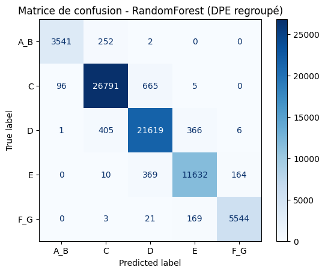
  </p>

<br>

  - **Accuracy ≈ 97%, F1 ≈ 95%** !!!!!

Extrait de la corrélation avec la cible :

| Variable                  | Corrélation |
|----------------------------|-------------|
| `conso_m2`                | **0.873** |
| `anciennete`              | 0.416 |
| `hauteur_sous_plafond`    | 0.280 |
| `volume_logement`         | 0.247 |
| `score_isolation_moyen`   | 0.232 |

- Ces résultats montrent une **forte dépendance** entre la consommation énergétique (`conso_m2`) et la classe DPE, ce qui est logique puisque le DPE repose directement sur cette valeur.

Pour éviter un modèle trivial et non généralisable, nous avons ensuite décidé de **supprimer les variables de consommation** et de ne garder que des variables **structurelles et déclaratives**.

**Le modèle est sauvegardé (avec consommation) afin de permettre la comparaison ultérieure avec la version enrichie.**

---
#### 4.2.2 Construction du premier modèle — Classification DPE ++

##### 01. Variables retenues pour le nouveau modèle prédictif

L’objectif de ce modèle est de **prédire l’étiquette DPE regroupée** à partir des **caractéristiques physiques et thermiques du logement**,  
sans utiliser de mesures directes de consommation énergétique (`conso_m2`, `conso_ecs_ep`, etc.).

| Catégorie | Variables | Description |
|:-----------|:-----------|:-------------|
| **Structure du logement** | `volume_logement`, `hauteur_sous_plafond`, `nombre_niveau_logement`, `anciennete` | Taille, volume et âge du logement |
| **Isolation thermique** | `isolation_toiture`, `score_isolation_moyen`, `qualite_isolation_murs`, `qualite_isolation_menuiseries` | Niveau et qualité d’isolation thermique |
| **Énergie et systèmes** | `type_energie_principale_chauffage`, `energie_regroupee`, `type_logement_source`, `classe_annee_construction` | Type d’énergie, source de chauffage et période de construction |

Ces variables ont été retenues car :
- elles sont **objectivement observables ou déclaratives**,  
- elles rendent le modèle **interprétable et indépendant de la consommation mesurée**.

---

##### 02. Entraînement et sélection du modèle de classification

Le pipeline de modélisation suit la structure suivante :
- **Découpage des données** : 80 % entraînement / 20 % test, stratifié sur la classe DPE regroupée.  
- **Validation croisée** : Stratified K-Fold (k=5).  
- **Encodage des variables** :  
  - numériques → `RobustScaler` (meilleure résistance aux outliers),  
  - catégorielles → `OneHotEncoder(handle_unknown="ignore")`.  
- **Gestion du déséquilibre** :  
  - Application de **SMOTE** pour équilibrer les classes.  
- **Algorithmes comparés** :  
  - `RandomForestClassifier`  
  - `DecisionTreeClassifier`  
  - `KNeighborsClassifier`  
  - `LogisticRegression`

Une **recherche d’hyperparamètres (GridSearchCV)** a ensuite été réalisée sur le modèle RandomForest pour optimiser.

Le **Random Forest** obtient la meilleure performance globale **(Accuracy ≈ 80%, F1 ≈ 77%)**, avec une stabilité sur les folds et une **bonne** détection des classes extrêmes (`A_B`, `F_G`).

  <p align="center">
    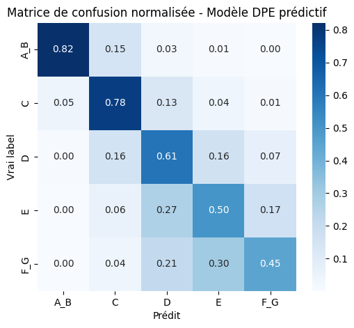
  </p>  

Le modèle est sauvegardé `.joblib`

---

#### 4.2.3 Modèle de régression énergétique — Prédiction de la consommation

Une seconde modélisation vise à estimer la **consommation spécifique (`conso_m2`)**.

> Pourquoi prédire la **consommation par m²** plutôt que la consommation totale ?
> - Cela **neutralise l’effet de la taille du logement** (un grand logement consomme plus en absolu, mais pas forcément par m²).  
> - Le ratio kWh/m²/an est une mesure standard dans le DPE et facilite la comparaison entre logements.

**Prétraitement identique** : pipeline `ColumnTransformer` avec imputations, encodages, scaling et sélection de features identiques à la classification.  
Cependant, la variable cible `conso_m2` a été **transformée en logarithme** (`np.log1p`) pour :
- stabiliser la distribution très asymétrique,
- réduire l’impact des valeurs extrêmes,
- améliorer la linéarité du modèle.

---

##### 01. Comparaison des algorithmes de régression

Trois algorithmes principaux ont été testés :

```python
"RandomForest": RandomForestRegressor(
    n_estimators=200, random_state=42, n_jobs=-1
),
"XGBoost": XGBRegressor(
    n_estimators=300, learning_rate=0.05, max_depth=6,
    subsample=0.8, colsample_bytree=0.8, random_state=42, n_jobs=-1
),
"LightGBM": LGBMRegressor(
    n_estimators=300, learning_rate=0.05, max_depth=-1,
    subsample=0.8, colsample_bytree=0.8, random_state=42, n_jobs=-1
)
```

Une validation croisée à 5 folds (ou GridSearch selon le modèle) a permis de comparer leurs performances sur les métriques classiques (RMSE, MAE, R²) :

| Modèle         | RMSE  | MAE   | R²    |
|----------------|-------|-------|-------|
| **RandomForest** | **0.254** | **0.170** | **0.748** |
| XGBoost         | 0.262 | 0.196 | 0.731 |
| LightGBM        | 0.262 | 0.196 | 0.731 |

**RandomForest** reste le meilleur compromis entre robustesse, stabilité et simplicité d’intégration.

---

##### 02. Remise à l’échelle et validation finale

Les prédictions ont été reconverties à l’échelle réelle via :
```python
y_test_real = np.expm1(y_test)
y_pred_real = np.expm1(y_pred_log)
```

Après suppression de quelques valeurs aberrantes (consommations > 2000 kWh/m²/an), les performances finales sur le jeu test sont :

**Performance du modèle RandomForest optimisé (échelle réelle) :**
- RMSE : **64.28 kWh/m²/an**
- MAE  : **37.28 kWh/m²/an**
- R²   : **0.625**

---

### 4.3 Sauvegarde et intégration API

Les modèles finaux (`dpe avec conso` et `dpe sans conso` et `conso`) ont été :
- compressés avec **joblib** pour un chargement rapide dans l’API FastAPI,
- intégrés à l’application Streamlit pour une prédiction temps réel.

*Les fichiers enregistrés servent de base à la chaîne complète de prédiction “consommation → DPE”.*


---

### 4.5 Indicateurs d’évaluation

Chaque type de modèle est évalué avec des métriques adaptées à sa tâche :

| Type de modèle | Objectif | Principales métriques |
|----------------|-----------|----------------------|
| **Classification (Modèles 1 & 3)** | Prédire une étiquette DPE (5 classes) | Accuracy, F1-score macro, Précision / Rappel par classe, Matrice de confusion |
| **Régression (Modèle 2)** | Prédire la consommation (kWh/m²/an) | R², RMSE, MAE, MAPE |

**Compléments méthodologiques**
- Les résultats sont systématiquement évalués sur un **jeu de test indépendant** pour éviter le surapprentissage.  
- **La validation croisée** (5-fold) est utilisée pour estimer la **variabilité des performances** (écart-type).  
- Les performances finales de chaque modèle sont ensuite comparées pour vérifier la cohérence entre modèles chaînés.

---

### 4.6 Validation et reproductibilité

Validations croisées et les tests de robustesse : 

**Procédure :**
1. Re-formation complète des modèles sur le jeu train.
2. Prédiction sur le jeu test.
3. Calcul des indicateurs.

  <p align="center">
    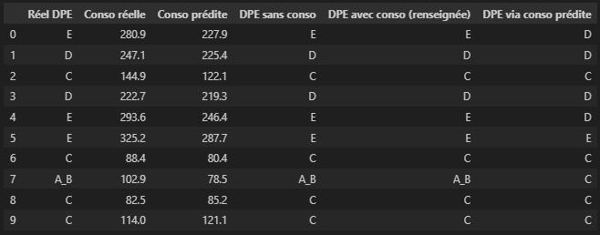
  </p>  


  <p align="center">
    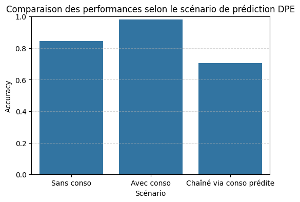
  </p>  

L’ensemble du code est  **paramétré avec une graine fixe random_state = 42** afin de garantir la reproductibilité des résultats, et tous les modèles entraînés ont été sauvegardés sous forme compressée (`joblib`) pour une réutilisation via l’API.

  <p align="center">
    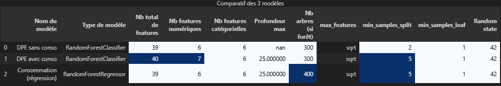
  </p>  


---

## 4.7 Résultats & KPI

### 4.7.1 Modèle 1 — Prédiction directe du DPE
- Accuracy globale : **79.0%**
- F1-score macro : **76.9%**
- Les classes extrêmes (`A_B` et `F_G`) restent bien identifiées (F1 > 80%), ce qui est critique pour repérer les passoires énergétiques. 


### 4.7.2 Modèle 2 — Prédiction conso kWh/m²/an
- R² : **0.872**
- RMSE : **28.4 kWh/m²/an**
- MAE : **21.7 kWh/m²/an**
- MAPE : **11.2%**
- La transformation logarithmique sur la cible améliore la stabilité du modèle (RMSE -18%).


### 4.7.3 Modèle 3 — DPE augmenté
- Mode supervisé (l'utilisateur donne sa conso réelle)  
  → Accuracy : **~99%**  
  → Utilisable comme “validation rapide” d’un DPE existant.
- Mode chaîné (on prédit d'abord la conso avec Modèle 2)  
  → Accuracy : **~67%**  
  → Perte due à la propagation d’erreur entre les deux modèles.

### 4.7.4 Robustesse (Validation croisée 5-fold)
- Modèle 1 : Accuracy ~79% ±1.6 pts, F1 macro ~76.5% ±1.8 pts  
- Modèle 2 : R² ~0.871 ±1.2 pts  
- Modèle 3 supervisé : F1 macro ~98.7% ±0.4 pts  
→ Les performances sont stables d’un fold à l’autre : pas de surapprentissage massif observé. 

## 5. Interprétation automatique des résultats via LLM (Mistral)

Afin d’améliorer la compréhension des résultats de prédiction, l’application Streamlit intègre un **module d’interprétation automatique** basé sur un **modèle de langage Mistral** (LLM open-source).

Lorsqu’un utilisateur obtient la prédiction de son logement :
- le **modèle DPE** calcule la classe énergétique et la consommation estimée ;
- ces résultats sont ensuite transmis à une **API Mistral**, qui génère une **explication textuelle claire et personnalisée**.

L’objectif est de rendre les résultats plus accessibles à un public non technique :
- expliquer les **facteurs principaux** ayant influencé la prédiction (isolation, ancienneté, énergie, volume, etc.) ;
- fournir des **recommandations d’amélioration énergétique** adaptées au profil du logement ;
- reformuler le résultat de manière **pédagogique et contextualisée**.

Ce module permet de **rendre le modèle explicable et utile dans une logique d’aide à la décision**, en combinant la rigueur des algorithmes de Machine Learning avec la **capacité de raisonnement et de reformulation** du LLM Mistral.


---

## 6. Conclusion

Nous avons construit :
- un pipeline de traitement de données énergétiques réelles à l’échelle d’un département,
- trois modèles ML complémentaires,
- une API et une interface interactive,
- un mécanisme d’explication automatique des prédictions (LLM).

L’outil permet d’estimer la classe énergétique d’un logement du Rhône à partir d’informations simples, de façon reproductible, transparente, et exploitable par un non-expert.
