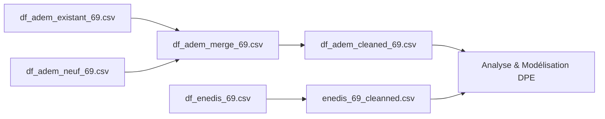

# Jeu de données — Projet DPE Enedis

Ce dossier contient plusieurs fichiers CSV utilisés dans le cadre du projet **d’analyse et de prédiction du Diagnostic de Performance Énergétique (DPE)** pour le département **69 (Rhône)**.  
Chaque fichier correspond à une étape du nettoyage, de la fusion ou de la préparation des données issues des sources ADEME et Enedis.

[Drive](https://drive.google.com/drive/folders/1NjLfpj6XLA7IAXIhpG7oQNQmfbQ9v_MO)

---

## Description des fichiers

### `adresses-69.csv`
- Contient les **adresses géographiques de référence** pour le département 69.  
- Utilisé pour enrichir les jeux de données ADEME ou Enedis avec des **coordonnées, codes postaux, et informations communales**.

---

### `colonnes_dpe_existant.csv`
- Liste des **colonnes pertinentes pour les bâtiments existants** (issus du DPE existant ADEME).  
- Sert de référence pour filtrer ou renommer les colonnes dans les fichiers sources.

---

### `colonnes_dpe_neuf.csv`
- Liste des **colonnes pertinentes pour les bâtiments neufs** (issus du DPE neuf ADEME).  
- Utilisée pour uniformiser les structures avant fusion avec les données existantes.

---

### `df_adem_69.csv`
- Jeu de données **brut** provenant d’ADEME pour le département 69 existant.  
- Contient les diagnostics DPE avant nettoyage : colonnes nombreuses, valeurs manquantes, et hétérogènes.

---

### `df_adem_neuf_69.csv`
- Données ADEME spécifiques aux **bâtiments neufs** dans le département 69.  
- Avant fusion avec les DPE existants.

---

### `df_adem_cleaned_69.csv`
- Version **nettoyée** de `df_adem_69.csv`.  
- Étapes appliquées :
  - Suppression ou correction des valeurs aberrantes.
  - Harmonisation des types (numériques, dates, etc.).
  - Conservation uniquement des colonnes pertinentes pour la modélisation.

---

### `df_adem_merge_69.csv`
- Fichier **fusionné** combinant les DPE **existants** et **neufs**.  
- Structure homogène et prête pour l’analyse exploratoire ou la modélisation.

---

### `df_enedis_69.csv`
- Données issues d’**Enedis** (consommations énergétiques réelles).  
- Utilisées pour croiser les consommations observées avec les estimations du DPE ADEME.  
- Peut contenir : consommation annuelle, surface, code postal, etc.

---

## Flux de traitement

